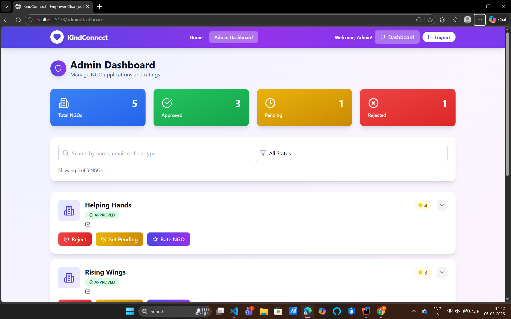

# 🌟 KindConnect – Smart Charity Donation Distribution System

A microservices-based platform that connects **Donors, NGOs, and Drivers** to streamline charity donation management and ensure transparent resource distribution.

## 🚀 Features

* Secure JWT Authentication
* Role-Based Access Control (Donor, NGO, Driver, Admin)
* Donation Posting & Management
* NGO Verification System
* Smart NGO Matching
* Driver Assignment & Delivery Tracking
* Real-Time Donation Status Updates
* Admin Dashboard & Monitoring
* Secure REST APIs

---

## 🛠️ Tech Stack

### Frontend

* React.js
* JavaScript
* Tailwind CSS

### Backend

* Spring Boot
* Spring Cloud
* Spring Security
* REST APIs

### Database

* MySQL

### Tools

* Git
* GitHub
* Maven
* Postman

---

## 📂 Project Structure

```text
KindConnect/
├── frontend/
├── user-service/
├── donation-service/
├── ngo-service/
├── api-gateway/
├── database/
└── README.md
```

---

## 📸 Screenshots

### Login Page


### Home Page


### Fundraisers


### Detailed Fundraiser


### NGO Dashboard


### Driver Dashboard


### Admin Dashboard



---

## ⚙️ Installation

```bash
git clone https://github.com/yagnik1505/KindConnect-Smart-Charity-Donation-Distribution-System.git

cd KindConnect-Smart-Charity-Donation-Distribution-System

mvn clean install
```

For frontend:

```bash
cd frontend

npm install

npm run dev
```

---

## 🎯 Future Enhancements

* AI-Based NGO Recommendation
* Mobile Application
* Payment Gateway Integration
* Real-Time Analytics Dashboard

---

## 👨‍💻 Authors

**Het Sonani**
GitHub: https://github.com/sonanihet2410

**Yagnik Pansheriya**
GitHub: https://github.com/yagnik1505
